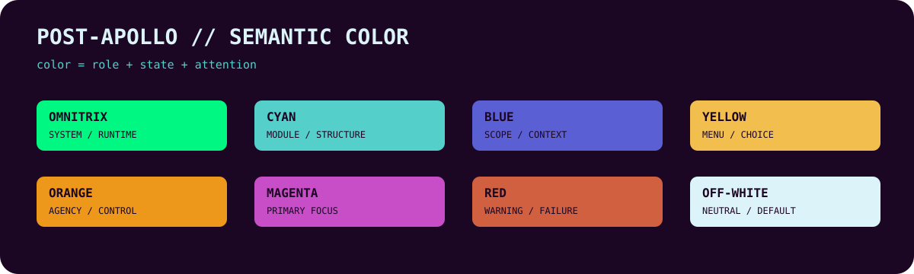

# 🧭 MAP // ATLAS


> **STATE //** active \~\~ **HEALTH //** ࣪˖ദ്ദി๋࣭⭑ VERIFIED \~\~ **VIEW //** repository orientation

// **[🧭 ATLAS](../ATLAS/)** \~\~ // [✮˙๋࣭⭑ MODEL](../MODEL/) \~\~ // [🖨 BUILD](../BUILD/) \~\~ // [⚒ DEV](../DEV/) \~\~ // [🖳 OPERATE](../OPERATE/) \~\~ // [⊹ ࣪ℼ˖ EVIDENCE](../EVIDENCE/) \~\~ // [࣪⋅˚🕮‧₊˚ ARCHIVE](../ARCHIVE/)

---

> **The map of the whole territory.**

## ★⋆˙ CORE // WHAT THIS ROOM IS


ATLAS orients readers to Meta Apollo Logos as a whole: what is active, what is being edited, and where the major bodies of work live.

### 🧭 MAP // REPOSITORY AT A GLANCE


| ROOM | PURPOSE | CURRENT CONTENT |
|---|---|---|
| **ATLAS** | orient | editing queue, navigation, repository state |
| **MODEL** | explain | philosophy, principles, cognitive model, design language |
| **BUILD** | make | reusable README template and seven-room skeleton |
| **DEV** | test | header and symbol render experiments |
| **OPERATE** | use | application and maintenance guidance |
| **EVIDENCE** | demonstrate | cognitive evidence and package stress tests |
| **ARCHIVE** | preserve | How-I-Think development history and Post-Apollo history |

## 🧭 CONTENTS // CURRENT


- [Editing Queue](./EDITING-QUEUE.md)
- repository-wide navigation
- current structural orientation
- canonical diagram-language reference

## 🧭 MAP // WHERE TO GO NEXT


- Need the philosophy, cognitive model, principles, or design language? Go to **MODEL**.
- Need the reusable repository artifacts? Go to **BUILD**.
- Need to apply the system? Go to **OPERATE**.
- Need proof or test outcomes? Go to **EVIDENCE**.
- Need preserved history? Go to **ARCHIVE**.

<details>
<summary>🧭 LEGEND // DIAGRAM LANGUAGE</summary>



```text
NODES //

[THING]          ordinary thing in the system
{QUESTION?}      decision / condition / branch
((EVENT))        event / trigger
[(DATA)]         stored / persistent state
[[SURFACE]]      visible UI / interface

GHOST STRINGS //

~~               stable connection / relationship
~~»              flow / dependency / direction
~ ~ ~            indirect / optional / provisional connection
~ ~ ~»           provisional / conditional flow
~~»>             major path / primary pipeline

BOUNDARIES //

SYSTEM //         system / runtime
MODULE //         architectural grouping
OWNER //          responsibility / control
SCOPE //          diagram / context boundary

COLOR //

OMNITRIX GREEN    #00F782   system / runtime
CYAN              #55CFCA   module / normal structure
BLUE              #5B5FD4   scope / context
YELLOW            #F2BE4E   menu / navigation / available choice
ORANGE            #ED981A   activity / agency / control / ownership
MAGENTA           #C74EC7   highest importance / primary focus
RED               #D16041   warning / failure / destructive state
OFF-WHITE         #DCF3FA   neutral / default information
PURPLE            #1B0623   background / chassis
```

> **Color is part of the language, but never the only carrier of meaning.**

</details>
