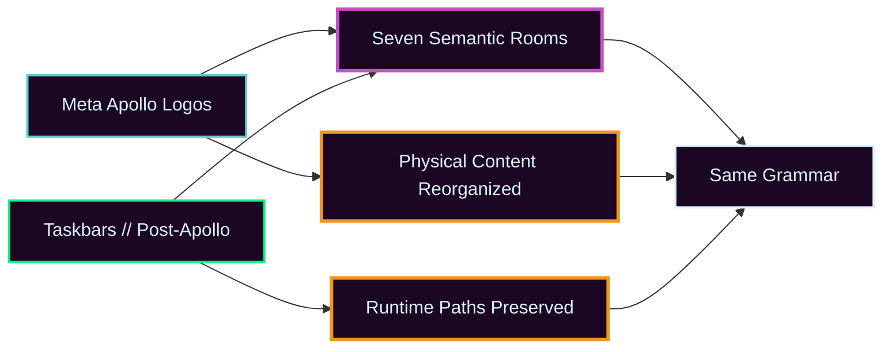

✦︎✦︎✦︎ Meta Apollo Logos //

# ⊹ ࣪ℼ˖ EVIDENCE // REPOSITORY DESIGN PACKAGE STRESS TESTS


> **STATE //** active \~\~ **HEALTH //** ࣪˖ദ്ദി๋࣭⭑ VERIFIED \~\~ **VIEW //** repository package stress tests

> **The repository grammar has been applied to two materially different repositories without requiring the same physical layout.**

## ࣪˖ദ്ദി๋࣭⭑ VERIFIED // TEST 1 — META APOLLO LOGOS

SCOPE // philosophy, history, cognitive model, reusable templates

Observed:

- the seven-room structure accepted the existing material without orphaning files
- How-I-Think separated naturally into MODEL, EVIDENCE, and ARCHIVE
- reusable templates resolved to BUILD
- render experiments resolved to DEV
- Post-Apollo history resolved to ARCHIVE
- the structural migration completed with no missing expected files and no leftover old paths

## ࣪˖ദ്ദി๋࣭⭑ VERIFIED // TEST 2 — TASKBARS // POST-APOLLO

SCOPE // live Quickshell software repository

Observed:

- the seven-room semantic layer fit the repository
- the live runtime tree remained physically at repository root
- `shell.qml`, `components/`, `modules/`, `services/`, `widgets/`, and `assets/` did not need to move
- BUILD could describe semantic ownership without forcing a destructive runtime-path migration
- the pass exposed real documentation gaps in MODEL, OPERATE, EVIDENCE, and ARCHIVE

## ★⋆˙ CORE // RESULT



```text
same semantic rooms
        ~~
different physical implementation
```

The current evidence supports this design rule:

> **Use Meta Apollo conventions for meaning and presentation. Preserve platform and runtime conventions for behavior.**

## ⊹⚡ ๋࣭⭑ PROVISIONAL // WHAT REMAINS TO TEST

- a repository with a conventional packaged language layout
- a repository with releases/distribution artifacts
- a repository with large image/screenshot evidence
- long-term maintenance after repeated updates
