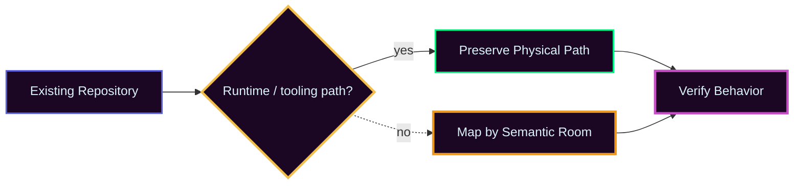

# 🖳 MAP // OPERATE

STATE // active

// [🧭 ATLAS](../ATLAS/) \~\~ // [✮˙๋࣭⭑ MODEL](../MODEL/) \~\~ // [🖨 BUILD](../BUILD/) \~\~ // [⚒ DEV](../DEV/) \~\~ // **[🖳 OPERATE](../OPERATE/)** \~\~ // [⊹ ࣪ℼ˖ EVIDENCE](../EVIDENCE/) \~\~ // [࣪⋅˚🕮‧₊˚ ARCHIVE](../ARCHIVE/)

---

> **Use the thing.**

## ★⋆˙ CORE // WHAT THIS ROOM IS

OPERATE explains how to apply and maintain the Meta Apollo repository system without treating the template as a rigid filesystem law.

## ⌯✦ PROCESS // APPLY THE PACKAGE

| STEP | ACTION |
|---|---|
| 1 | establish the repository identity and front door |
| 2 | create all seven canonical rooms |
| 3 | map existing material by meaning before moving anything |
| 4 | preserve root files and runtime paths that tooling depends on |
| 5 | add Ghost String navigation and room maps |
| 6 | apply status, symbols, tables, collapsibles, diagrams, and color only where useful |
| 7 | verify links, paths, and runtime assumptions |
| 8 | record what the application exposed in EVIDENCE |

> **Do not reorganize working machinery merely to make the tree look pure.**

## ✮˙๋࣭⭑ MODEL // APPLICATION RULE



```text
[Existing Repository]
        ~~»
{Does this path carry runtime/tooling meaning?}
        ~~» yes ~~» [Preserve physical path]
        ~ ~ ~» no ~ ~ ~» [Move by semantic room]
```

<details>
<summary>⚒ DEV // MIGRATION CHECKLIST</summary>

- identify files that GitHub or tooling expects at root
- identify runtime-relative paths and import assumptions
- classify content before moving it
- move history/provenance only when its status is actually known
- update internal links after every structural move
- verify all seven room maps exist
- verify the ATLAS legend exists
- confirm color never carries meaning alone
- check that collapsibles hide depth, not required instructions
- record the application result in EVIDENCE

</details>

## 🧭 MAP // WHERE TO GO NEXT

- Need the rules? Go to **MODEL**.
- Need the reusable files? Go to **BUILD**.
- Need proof that the package survived real repositories? Go to **EVIDENCE**.
