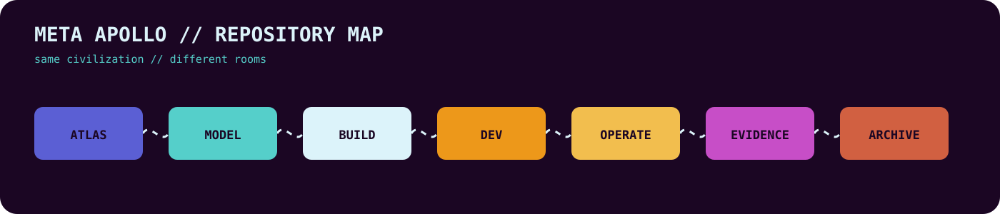

✦︎✦︎✦︎ Meta Apollo Logos //

# ✮˙๋࣭⭑ META APOLLO LOGOS // POIOUMENON

STATE // active
HEALTH // ⊹⚡ ๋࣭⭑ PROVISIONAL

**[META APOLLO LOGOS // PRINCIPLES](./MODEL/Meta-Apollo-Logos-Principles.md)** — canonical principles reference.

### 🧭 MAP // REPOSITORY

// [🧭 ATLAS](./ATLAS/) \~\~ // [✮˙๋࣭⭑ MODEL](./MODEL/) \~\~ // [🖨 BUILD](./BUILD/) \~\~ // [⚒ DEV](./DEV/) \~\~ // [🖳 OPERATE](./OPERATE/) \~\~ // [⊹ ࣪ℼ˖ EVIDENCE](./EVIDENCE/) \~\~ // [࣪⋅˚🕮‧₊˚ ARCHIVE](./ARCHIVE/)

---

> **What do we do after the sun dies? The search for an answer.**

This repository is the record of the making of Meta Apollo Logos.

It holds the reasoning, evidence, history, experiments, and accumulated writing behind Post-Apollo: why it exists, how it came to be, and how the understanding of it continues to change.

> **It is not a finished doctrine.**  
> **It is not a final answer.**  
> **It is a living record of an answer being made.**

---

### ✮˙๋࣭⭑ MODEL // THE CAMERA

> **Do not mistake the camera for the world.**

A person encounters reality through a particular camera: body, history, relationships, memories, knowledge, attention, experience, and everything else that makes one person different from another.

### The camera

- Every camera is different.
- The world remains shared.
- The camera can be wrong.
- The camera can be improved.
- The camera can become something worth examining in its own right.

Meta Apollo Logos is one such representation.

The question is not whether the camera is perfect.

The question is whether it can be examined, corrected, and used to look at the world more clearly.

---

### ⌯✦ PROCESS // THE MAKING

Meta Apollo Logos was not designed as a finished philosophy and implemented afterward.

The thinking, making, observing, documenting, and changing happened together.

### ⌯✦ PROCESS // THE LOOP

**Think** → **make** → **observe** → **document** → **understand** → **make again**

The result becomes evidence about the reasoning that produced it.

The evidence becomes material for the next round of reasoning.

> **The documentation is part of the project.**

---

## ˖ ࣪♻๋࣭⭑ RELATIONSHIP // THE LIGHT

Something can be received without remaining unchanged.

### Transmission

- Words can be carried forward.
- Ideas can be transformed.
- Tools can extend what a person is able to do.
- A work can outlive the person who made it.
- A capability can pass from hand to hand.

**The carrier changes.**

**The thing being carried changes with it.**

> **The light continues.**

This repository is one place where that process is recorded.

---

## ★⋆˙ CORE // TOOLS AND AUTHORSHIP

Tools have always extended human reach.

### The rule

- If it is useful, use it.
- If it is not, do not.
- If another tool works better, use that one.
- If the work is better done by hand, do it by hand.

A tool can remove mechanical effort without removing human judgment.

It can carry weight without choosing where to go.

### The division

**The tool provides capability.**

**The person provides direction.**

The work can be made easier without making authorship meaningless.

The person still decides:

- what is worth making
- what is wrong
- what should change
- what is worth keeping

---

## ⌯✦ PROCESS // THE MAKING REMAINS OPEN

The working name for this process is:

> **Koinō Nō Poioumenon**  
> *Being made with common sense.*

### Not the same thing

**Not made.**

**Not finished.**

**Being made.**

The final version may not exist.

A work can be stopped without being exhausted.

A model can be useful without being final.

Understanding can continue after the document stops.

> **The making therefore remains open.**

---

## 🧭 MAP // WHAT LIVES HERE

The repository brings together material that was previously separated.

### **[Nous tou Anthrōpou // Poiētou](./MODEL/How-I-Think/)**

The public-facing cognitive map, selected evidence, and preserved development record behind the work.

### **[Post-Apollo history](./ARCHIVE/Post-Apollo-History/)**

The events, decisions, experiments, and developments through which the work came to exist.

### **Meta Apollo Logos**

The larger body of ideas, relationships, metaphysics, philosophy, and meaning that those materials point toward.

### **Poioumenon**

The record of the making itself: the process by which the explanation, the evidence, and the thing being explained continue to shape one another.

> These boundaries may change.

> **The repository is allowed to discover its own structure.**

---

## ⌯✦ PROCESS // THE LOOP

There is no final box at the end.

### One continuous movement

**reality**  
↓  
**camera**  
↓  
**representation**  
↓  
**observation**  
↓  
**documentation**  
↓  
**new understanding**  
↓  
**changed camera**  
↓  
**new representation**  
↓  
**...**

The loop continues until it doesn't.

The document ends.

The making does not necessarily end with it.

### What gets carried

**Something is received.**

↓  

**Something is understood.**

↓  

**Something is changed.**

↓  

**Something is carried forward.**

↓  

**Eventually, someone else receives it.**

---

## ˖ ࣪♻๋࣭⭑ RELATIONSHIP // THE SPIRIT

What remains is not simply the files.

Not the repository.

Not the code.

Not the words alone.

> **The spirit is what can continue through them.**

It can be carried by:

- a person
- a sentence
- an image
- a piece of software
- a work of art
- a place
- an institution
- something not yet imagined

### The carrier can change.

The representation can change.

The person can change.

The thing being carried can change with them.

What matters is the relationship that continues through those changes.

> **That is the spirit of the project.**

It is why the work can outlive the moment in which it was made.

It is why the record belongs with the thing it records.

It is why the making remains open.

---

## ★⋆˙ CORE // THE THREE PIECES

**Concept** → something can begin in one person and become part of the world as it is carried.

**Spirit** → what can remain recognizable while the carrier changes.

**Proof of spirit** → Meta Apollo Logos itself has moved through changing people, names, documents, projects, and representations while remaining recognizable enough to continue.

> **Look at the whole thing. Test it. Change it when it does not fit. Carry forward what survives.**

## ✮˙๋࣭⭑ MODEL // POIOUMENON

**The Logos being made.**

---

## ✮˙๋࣭⭑ MODEL // REPOSITORY DESIGN LANGUAGE

Meta Apollo repositories use a shared semantic and visual grammar:

> **ATLAS · MODEL · BUILD · DEV · OPERATE · EVIDENCE · ARCHIVE**

- **[Repository Design Language](./MODEL/Repo-Design-Language.md)** — the rules and principles.
- **[Reusable README Template](./BUILD/templates/META-APOLLO-README-TEMPLATE.md)** — the root front-door template.
- **[Repository Skeleton](./BUILD/templates/repo-skeleton/)** — the copy-paste seven-room filesystem with a map in every room.

The goal is not identical repositories.

The goal is **different buildings from the same civilization**.
