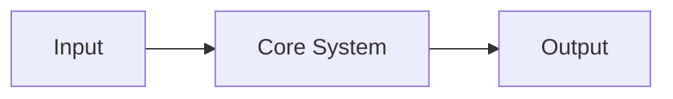

# <REPOSITORY NAME>

<!-- Optional: replace with a Meta Apollo banner / SVG -->
<!-- <picture>...</picture> -->

### <ONE-LINE PURPOSE>

**<STATUS> · <PRIMARY MODE OR PROJECT TYPE>**

> **<ONE SENTENCE THAT DEFINES THE PROJECT>**

---

## Start here

<2–4 sentences explaining what this project is, why it exists, and who should care.>

**Fast path:** <Tell a new reader what to read / run first.>

---

## Repository map

| Mode | Purpose | Go here |
| --- | --- | --- |
| **MAP** | What is this? | You are here |
| **MODEL** | How does it work? | [Architecture / Concepts](#model) |
| **BUILD** | Where is the machinery? | [Source / Developer guide](#build) |
| **OPERATE** | How do I use it? | [Usage / Runbook](#operate) |
| **EVIDENCE** | Why trust it? | [Tests / References / Results](#evidence) |
| **ARCHIVE** | How did we get here? | [History / Archive](#archive) |

Remove rows that do not apply.

---

# MAP

## 01 · Purpose

<What problem exists?>

<Why does this repo exist?>

## 02 · Current state

- **Status:** <experimental / active / stable / archived>
- **Primary branch:** `<branch>`
- **Primary interface:** <CLI / desktop / library / document / service>
- **Next meaningful milestone:** <milestone>

## 03 · System at a glance



Replace with the smallest diagram that actually explains the object.

---

# MODEL

## 04 · Architecture

<Explain the major components and their relationships.>

## 05 · Core contracts

<What must remain true?>

## 06 · Data / state flow

<How does information move?>

## 07 · Design principles

- <Principle>
- <Principle>
- <Principle>

---

# BUILD

## 08 · Source map

```text
src/
├── <component>
├── <component>
└── <component>
```

Explain what the important directories **mean**.

## 09 · Primary entry points

| Entry point | Role |
| --- | --- |
| `<path>` | <purpose> |
| `<path>` | <purpose> |

## 10 · Developer setup

```bash
<install / build commands>
```

## 11 · Extension points

<Where can someone safely add capability?>

## 12 · Tests

```bash
<test command>
```

---

# OPERATE

## 13 · Quick start

```bash
<run command>
```

## 14 · Common workflows

### <Workflow>

```text
action
→ state change
→ expected result
```

## 15 · Configuration

<Important configuration locations and defaults.>

## 16 · Recovery / troubleshooting

| Symptom | Check | Recovery |
| --- | --- | --- |
| <symptom> | <check> | <action> |

---

# EVIDENCE

## 17 · What supports the design

Use only what applies:

- tests
- benchmarks
- screenshots
- experiments
- source references
- comparison systems
- user evidence
- historical precedent

## 18 · Known limits

> **A model that cannot lose cannot win.**

<List meaningful limitations, unresolved questions, and failure conditions.>

---

# ARCHIVE

## 19 · Provenance

<Why does the current architecture exist?>

## 20 · Superseded work

| Old object | Status | Replacement |
| --- | --- | --- |
| <old> | superseded | <new> |

## 21 · Deep source

<Link to history, long-form notes, old implementations, or archaeology.>

---

# Design rule

> **Unfinished does not mean unusable, illegible, or ugly.**

The current version should already be understandable and recognizably part of Meta Apollo.

**MAP · MODEL · BUILD · OPERATE · EVIDENCE · ARCHIVE**
